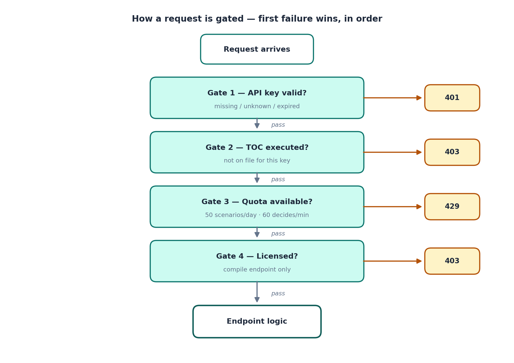
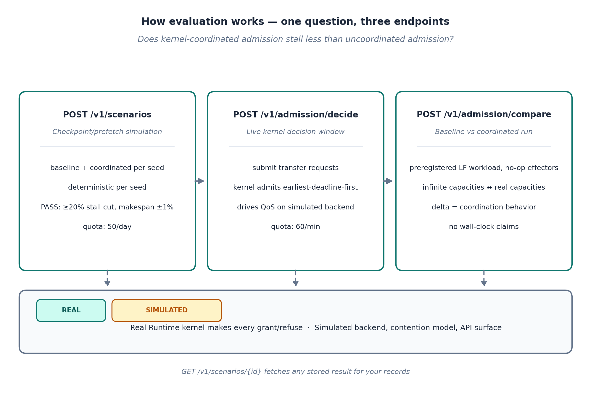
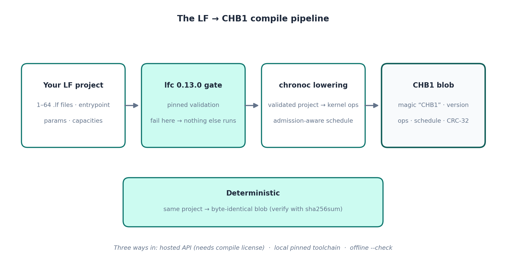

# How ChronoHive Works

> © 2026 Layer1Labs Silicon Inc. All rights reserved.
> **CONFIDENTIAL — PROPRIETARY.** This document describes a confidential
> evaluation service. Licensed solely for evaluation under the ChronoHive
> Terms of Confidentiality (`../TOC.md`) and the ChronoHive Evaluation
> License (`../LICENSE`). **Do not distribute.**

A plain-language tour of the ChronoHive evaluation system: what each part
does, how a request flows through it, and how to read your evaluation
numbers honestly.

## The big picture

ChronoHive is a **storage-admission kernel**: it decides which I/O work gets
admitted, when, and at what quality-of-service level — so that coordinated
workloads stall less than uncoordinated ones. The evaluation package lets
you drive the **real kernel** over HTTPS and measure that coordination
behavior. The storage hardware underneath is **simulated**; the decisions
are not.

```
 ┌──────────────────┐      HTTPS/TLS       ┌─────────────────────────────┐
 │  Your machine    │ ────────────────────▶ │  api.layer1labs.ai          │
 │  (this package)  │                        │                             │
 │  · sign_toc.py   │ ◀──────────────────── │  · Caddy (TLS termination)  │
 │  · eval client   │      JSON responses    │  · Admission API            │
 │  · compile client│                        │  · Runtime kernel  ◀── REAL │
 └──────────────────┘                        │  · Simulated backend ◀── SIM│
                                             └─────────────────────────────┘
        ▲                                                        ▲
        │  API key (Bearer)                                      │  Admin key
        │  + executed TOC                                        │  (operator only)
        │                                                        │
 ┌──────┴───────┐                                    ┌───────────┴────────┐
 │  You         │                                    │  Operator (keymgr) │
 │  (evaluator) │                                    │  · issue keys      │
 └──────────────┘                                    │  · licenses        │
                                                     └────────────────────┘
```

**Figure 1 — System overview.** You talk to one HTTPS API. Behind it, the
real Runtime kernel makes every grant/refuse decision; a simulated storage
backend, contention model, and storage API surface stand in for hardware.
The operator side (key issuance, licenses) is separate and never exposed
to evaluators.

There are exactly three kinds of component in the system, and the honesty
of your evaluation depends on not confusing them:

| Component | Real or simulated? | What it means for you |
|---|---|---|
| Runtime kernel (admission decisions) | **Real** | Every grant/refuse comes from the kernel's capacity discipline. This is what you are evaluating. |
| Storage backend, contention model, storage API surface | **Simulated** | Stand-ins for hardware. They let the kernel's decisions play out observably without vendor hardware. |
| Your numbers (stall reduction, makespan) | **Simulation outcomes** | Valid for comparing *coordination behavior* (kernel vs uncoordinated). Not hardware measurements. Do not present them as such. |

## How a request is gated

Every request passes the same four gates before it reaches any endpoint
logic. The first failure wins, in this order:



**Figure 2 — Request gating.** `401` = your key is missing, unknown, or
expired. `403 toc_acceptance_required` = execute the TOC first (see
Quickstart). `429` = quota exhausted (50 scenarios/day, 60 decides/minute).
`POST /v1/lf/compile` has one extra gate: your key needs a **compile
license**, issued by the operator alongside your key.

## How evaluation works

Evaluation answers one question: **does kernel-coordinated admission stall
less than uncoordinated admission?** Three endpoints, one story:



**Figure 3 — The evaluation flow.**

1. **`POST /v1/scenarios` — the checkpoint/prefetch simulation.** Runs the
   same workload twice per seed: once *uncoordinated* (baseline — everything
   the schedule asks for is admitted) and once *kernel-coordinated* (the
   real kernel's admission discipline applies). Deterministic per seed: the
   same seed always produces the same result. A scenario **passes** when the
   coordinated run cuts stalls by ≥ 20% with makespan within 1% of baseline.
   Quota: 50 runs per key per rolling day.

2. **`POST /v1/admission/decide` — the live kernel decision path.** You
   submit transfer requests for one admission window; the real kernel
   admits them earliest-deadline-first against the provisioned write/read
   pipes and drives QoS levels on the simulated backend from its grant
   decisions. This is the kernel thinking out loud, one window at a time.
   Quota: 60 calls per key per minute.

3. **`POST /v1/admission/compare` — baseline vs coordinated, head to head.**
   A preregistered Lingua Franca workload runs twice through the real
   Runtime kernel with no-op effectors: once with effectively infinite
   capacities (uncoordinated baseline) and once with the blob's real
   capacities (coordinated). The delta *is* the kernel's coordination
   behavior — who is admitted when, what retries, what drops. Admission
   decisions are real; no I/O timing is simulated or measured, so no
   wall-clock speedup is claimed.

4. **`GET /v1/scenarios/{id}`** fetches any stored scenario result back for
   your records.

The worked example (`examples/eval_walkthrough.py`) runs this whole flow —
TOC → scenario → live decisions → result fetch — in one command. See the
Quickstart in `../README.md`.

## How compilation works

Lingua Franca workloads compile to `.chb` v1 blobs — the artifact the
engine executes. Compilation is a pipeline with a hard validation gate up
front:



**Figure 4 — The LF → CHB1 compile pipeline.**

1. **Your LF project** — a complete file map (1–64 `.lf` files), an
   entrypoint, integer params, and capacity declarations.
2. **`lfc` 0.13.0 validation gate** — the pinned Lingua Franca compiler
   checks the project. If it fails here, nothing else runs.
3. **`chronoc` lowering** — the ChronoHive compiler lowers the validated
   project to the kernel's operation set (e.g. `c.admit_checkpoint`) and
   serializes the **CHB1 blob**: magic `"CHB1"`, version, step table,
   string table, capacities, operations, schedule, LF→op bindings, source
   provenance (SHA-256, toolchain versions), and a CRC-32 trailer.
4. **Deterministic** — the same project always produces the byte-identical
   blob. Verify with `sha256sum`.

You can compile three ways: the hosted API (`clients/compile_client.py`
with `--api-url`, needs a compile license), the local pinned toolchain
(`--local`), or the offline self-test (`--check`, no network). Compiling
is optional for evaluation — the admission API needs neither `lfc` nor
`chronoc`. See `LF_TOOLCHAIN.md` for the toolchain pins and `../README.md`
for the commands.

## Reading your numbers honestly

- **Do compare:** coordinated vs uncoordinated *within* a scenario or
  compare run. That delta is the kernel's doing, and it is real.
- **Do not compare:** evaluation numbers against hardware measurements,
  or present them as hardware performance. The backend is simulated;
  every response says so (`"simulated_backend": true`).
- **Determinism is your friend:** scenarios are deterministic per seed, and
  compiles are byte-deterministic. If a number changes, something in the
  inputs changed — find it before concluding anything.

## Endpoint map

| Endpoint | What it does | Gate notes |
|---|---|---|
| `GET /v1/health` | Liveness + version + TOC hash | Public |
| `GET /v1/toc` | Canonical Terms of Confidentiality | Public |
| `POST /v1/toc/accept` | Submit signed TOC acceptance | Key required |
| `POST /v1/scenarios` | Run admission simulation (baseline + coordinated) | Key + TOC; 50/day |
| `GET /v1/scenarios/{id}` | Fetch a stored scenario result | Key + TOC |
| `POST /v1/admission/decide` | Live kernel decisions for one window | Key + TOC; 60/min |
| `POST /v1/admission/compare` | Baseline vs coordinated workload run | Key + TOC |
| `POST /v1/lf/compile` | Compile an LF project to a CHB1 blob | Key + TOC + compile license |

Full request/response contracts are in `API.md`.
