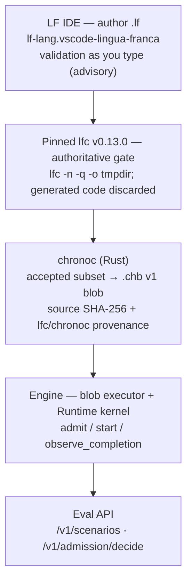

# Lingua Franca toolchain — authoring and compiling evaluation workloads

© 2026 Layer1Labs Silicon Inc. All rights reserved. CONFIDENTIAL — do not distribute.

Workloads evaluated through the API can be authored as Lingua Franca
programs and compiled to the binary blob (`.chb`) the ChronoHive engine
executes. This is optional: the API and the worked example need nothing
beyond a Python 3 interpreter and Docker. This doc is for evaluators who
want to define their own workloads in LF.

## The chain



Rules of the chain:

1. **Author** in the LF IDE (extension `lf-lang.vscode-lingua-franca`,
   needs Java 17+ for its language server). In-editor validation is
   advisory.
2. **Validate** with the pinned real `lfc` v0.13.0 — the sole authority
   on what is valid LF. Anything `lfc` rejects is never compiled.
3. **Lower** with `chronoc`: it consumes only `lfc`-accepted sources in
   the documented subset and emits a versioned `.chb` blob. `chronoc`
   performs no LF language validation of its own — `lfc` is the frontend,
   `chronoc` replaces `lfc`'s code generator with blob lowering.
4. **Execute**: the engine parses/validates the blob and drives admission
   through the real `Runtime` kernel. No generated LF code runs anywhere
   in this path; there is no LF runtime in the execution path.
5. **Evaluate**: the workload shapes (train / checkpoint / prefetch)
   parameterize API scenarios (`jobs`, `ckpt_gb`, `prefetch_gb`, …).

## The LF source in this package

`lf/IoCoordinator.lf` — the canonical workload: a timed training loop
(`Trainer`) driving periodic checkpoints (`CheckpointIO`) and read-ahead
(`PrefetchIO`).

- SHA-256:
  `0c33d636a19af7ae434940b2c29c56817ea334fa268620306bda67b3fa13b5a8`
- Verify: `sha256sum lf/IoCoordinator.lf`

## Compiling

`scripts/compile_lf.sh` compiles `lf/IoCoordinator.lf` to a `.chb` blob.
It needs the pinned `lfc` and a `chronoc` build; if either is missing it
prints exactly what to install instead of failing cryptically.

```sh
scripts/compile_lf.sh lf/IoCoordinator.lf -o /tmp/io.chb \
    --param steps=200 --capacity storage_bw=100
```

To set up the full authoring environment (IDE extension, Java, Rust,
pinned `lfc`, one-shot verification), see the ChronoHive repository:
`scripts/setup-ide.sh` and `docs/ide/VSCODE.md`.

## Toolchain pins

| Component | Pin |
|---|---|
| `lfc` | v0.13.0 (validation gate) |
| `chronoc` | v0.1.0 (Rust, LF → `.chb`) |
| Blob format | `.chb` v1 (`CHB1` magic, CRC-32 trailer) |
| LF IDE extension | `lf-lang.vscode-lingua-franca` |

Bumping the `lfc` pin requires re-validating every `.lf` source and
recompiling every blob — blobs carry `lfc` provenance so staleness is
detectable.
