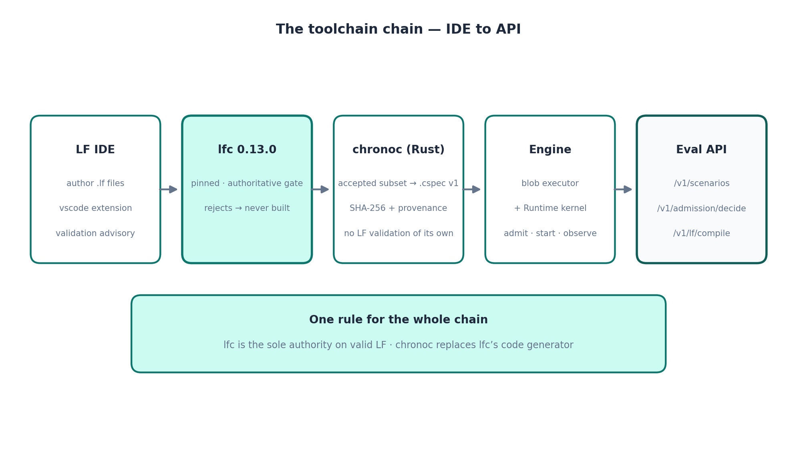

# Lingua Franca toolchain — authoring and compiling evaluation workloads

> © 2026 Layer1Labs Silicon Inc. All rights reserved.
> **CONFIDENTIAL — PROPRIETARY.** Licensed solely for evaluation under
> the ChronoHive Terms of Confidentiality (`../TOC.md`) and the
> ChronoHive Evaluation License (`../LICENSE`). **Do not distribute.**

Workloads evaluated through the API can be authored as Lingua Franca
programs and compiled to the constraint specification (`.cspec`) the ChronoHive engine
executes. This is optional: the API and the worked example need nothing
beyond a Python 3 interpreter. This doc is for evaluators who want to
define their own workloads in LF.

## The chain



Rules of the chain:

1. **Author** in the LF IDE (extension `lf-lang.vscode-lingua-franca`,
   needs Java 17+ for its language server; `.vscode/` in `lf/` is
   preconfigured). In-editor validation is advisory.
2. **Validate** with the pinned real `lfc` v0.13.0 — the sole authority
   on what is valid LF. Anything `lfc` rejects is never compiled.
3. **Lower** with `chronoc`: it consumes only `lfc`-accepted sources in
   the documented subset and emits a versioned `.cspec` specification. `chronoc`
   performs no LF language validation of its own — `lfc` is the frontend,
   `chronoc` replaces `lfc`'s code generator with specification lowering.
4. **Execute**: the engine parses/validates the specification and drives admission
   through the real `Runtime` kernel. No generated LF code runs anywhere
   in this path; there is no LF runtime in the execution path.
5. **Evaluate**: the workload shapes (train / checkpoint / prefetch)
   parameterize API scenarios (`jobs`, `ckpt_gb`, `prefetch_gb`, …), and
   a compiled specification is the deployment artifact the engine admits against.

## Guided demo

`scripts/demo-lf.sh` walks the whole chain in one go: it shows the LF
source, validates it with the pinned `lfc`, compiles it with `chronoc`
to a `.cspec` specification, and prints the specification's provenance (hashes, pins,
shape). Needs a JVM (Java 17+) and internet on first run (one-time
pinned-`lfc` download, SHA-256 verified).

```sh
scripts/demo-lf.sh
```

## Compiling

The canonical path is the compile client, which takes the **complete
project** (every `.lf` file as a file map) and supports three modes:

```sh
# 1. Hosted compile API (needs a TOC-executed key with a compile license):
python3 clients/compile_client.py --api-url https://api.layer1labs.ai \
    --api-key "$CHRONOHIVE_API_KEY" --capacity storage_bw=100 -o /tmp/io.cspec

# 2. Local pinned toolchain (lfc + chronoc on PATH, or LFC/CHRONOC/JAVA_HOME):
python3 clients/compile_client.py --local --capacity storage_bw=100 -o /tmp/io.cspec

# 3. Offline self-check — no network, no chronoc
#    (pinned lfc + a JRE are still required):
python3 clients/compile_client.py --check
```

`scripts/compile_lf.sh` compiles `lf/IoCoordinator.lf` to a `.cspec` specification.
It resolves the pinned `lfc` v0.13.0 and `chronoc` v0.1.0-alpha.1 from this
repo's `toolchain/` directory — `lfc` is fetched automatically on first
use (SHA-256 verified), `chronoc` is vendored (`toolchain/README.md`
has its provenance and rebuild instructions). A JVM (Java 17+) is the
only prerequisite: set `JAVA_HOME` or keep `java` on `PATH`.

```sh
scripts/compile_lf.sh lf/IoCoordinator.lf -o /tmp/io.cspec \
    --capacity storage_bw=100
```

Env overrides: `CHRONOC=<path>`, `LFC=<path>`, `JAVA_HOME=<path>`.
## The LF project in this package

`lf/` is a complete, self-contained project — see `lf/README.md`.
`lf/IoCoordinator.lf` is the canonical workload: a timed training loop
(`Trainer`) driving periodic checkpoints (`CheckpointIO`) and read-ahead
(`PrefetchIO`).

- Source SHA-256:
  `722970549e19eada4f955c5a519b8bf2c151dab400633c8e8e77c4aaa08f4a16`
- Verify: `sha256sum lf/IoCoordinator.lf`
- Reference specification: `lf/IoCoordinator.cspec.reference` — the exact pinned-toolchain
  output for the checked-in source (`steps=200`, `storage_bw=100`),
  verified by `clients/compile_client.py --check`.

## Toolchain pins

| Component | Pin | Source |
|---|---|---|
| `lfc` | v0.13.0 (validation gate) | `scripts/fetch-lfc.sh` (SHA-256 verified) |
| `chronoc` | v0.1.0-alpha.1 (Rust, LF → `.cspec`) | `toolchain/chronoc-linux-x86_64` (vendored) |
| Blob format | `.cspec` v1 (`CSP1` magic, CRC-32 trailer) | |
| LF IDE extension | `lf-lang.vscode-lingua-franca` | VS Code Marketplace |

Bumping the `lfc` pin requires re-validating every `.lf` source and
recompiling every specification — specifications carry `lfc` provenance so staleness is
detectable.

> © 2026 Layer1Labs Silicon Inc. All rights reserved. CONFIDENTIAL —
> PROPRIETARY. Do not distribute.
